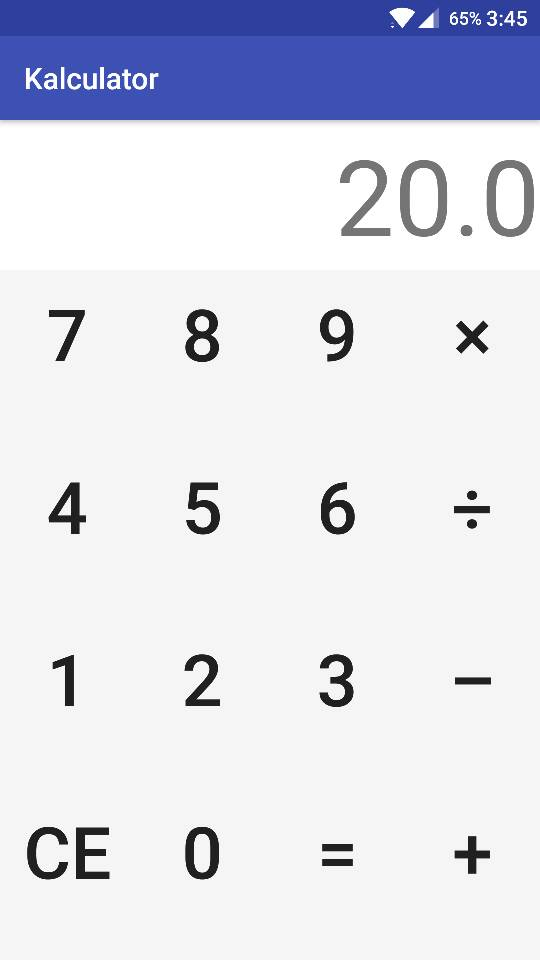

# Kalculator
A simple android calculator using Kotlin. The calculator was written along with this blog:
[https://aravindvasudevan.me/2017/my-day-1-with-kotlin/](https://aravindvasudevan.me/2017/my-day-1-with-kotlin/)

## Screenshot

